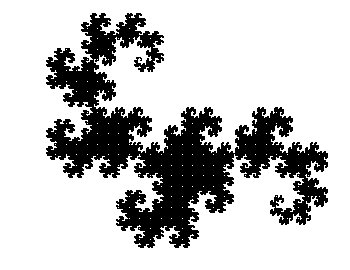
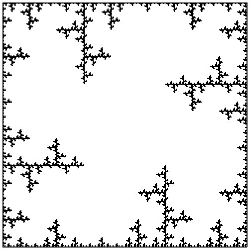
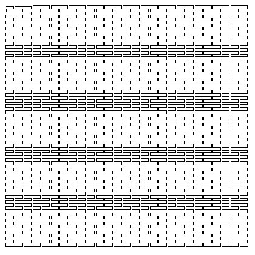
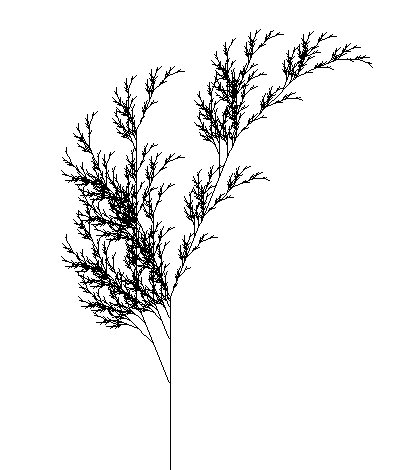
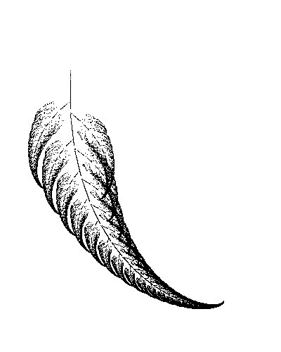
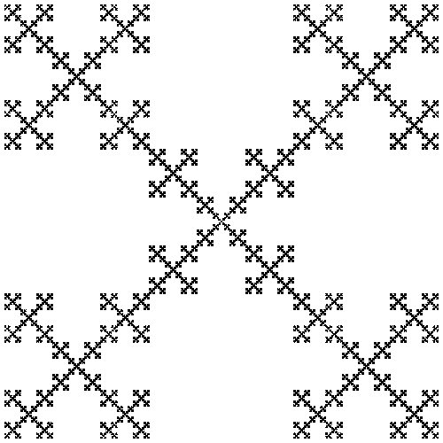

# Python+pygame的分形绘图操作封装

## install 

`pip install fractal`

Or download the package

`python setup.py install`

## Examples

### L-System


```python
from fractal import Pen
from math import sqrt
p = Pen([350, 270])
p.setPoint([140, 60])
p.setWidth(1)
p.doD0L(omega="L", P={"L": "L+R", "R": "L-R"},
              delta=90, times=15, length=200, rate=sqrt(2))
p.wait()

```



```python
from fractal import Pen

p = Pen([500, 500], title="Window")
p.setPoint([495, 495])
p.doD0L(omega="f+f+f+f", P={"f": "ff+f--f+f"},
        delta=90, times=5, length=490, rate=3, delta0 = 90)
p.wait()
```



```python
from fractal import Pen

p = Pen([420,420])

p.setPoint([10,10])

p.doD0L(omega = "L", P = {"L": "LFRFL-FF-RFLFR+FF+LFRFL", "R": "RFLFR+FF+LFRFL-FF-RFLFR"}, delta =  90, times = 4, length = 200 , rate = 3)

p.wait()
```



```python
from fractal import Pen

p = Pen([400, 470])

p.setAngle(90)

p.setPoint([200,470])

p.doD0L(omega = "f", P = {"f": "h[-f][+f]hf", "h": "hh"}, delta = 25.7, times = 7, length = 400, rate = 2.17)

p.wait()
```


```python
from fractal import Pen

p = Pen([400, 470])

p.setAngle(90)

p.setPoint([170, 470])

p.doD0L(omega="f", P={"f": "h+[[f]-f]-h[-hf]+f", "h": "hh"},
        delta=22.5, times=6, length=400, rate=2.3)

p.wait()
```



### IFS

```python
from fractal import IFS
from random import random


def ifsp(x, y):
    p = random()
    if p < 0.01:
        return (0, 0.16 * y)
    elif p < 0.07:
        if random() > 0.5:
            return (0.21 * x - 0.25 * y, 0.25 * x + 0.21 * y + 0.44)
        else:
            return (-0.2 * x + 0.26 * y, 0.23 * x + 0.22 * y + 0.6)
    else:
        return (0.85 * x + 0.1 * y, -0.05 * x + 0.85 * y + 0.6)

ob = IFS([400, 500], title = "蕨")
ob.setPx(100, 100, 100)
ob.setIfsp(ifsp)
ob.doIFS(200000)
ob.wait()
```



```python
# Box IFS
from fractal import IFS
from random import randint


def ifsp(x, y):
    p = randint(1, 5)
    if p == 1:
        return (x / 3, y / 3)
    elif p == 2:
        return (x / 3 + 2 / 3, y / 3)
    elif p == 3:
        return (x / 3 + 1 / 3, y / 3 + 1 / 3)
    elif p == 4:
        return (x / 3, y / 3 + 2 / 3)
    else:
        return (x / 3 + 2 / 3, y / 3 + 2 / 3)

ob = IFS([500, 500], title="Box")
ob.setPx(490, 5, 5)
ob.setIfsp(ifsp)
ob.doIFS(200000)
ob.wait()
```



